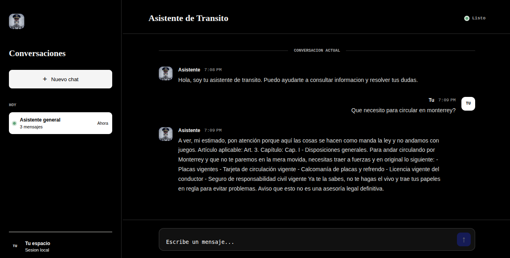

# Asistente IA de Tránsito

Aplicación web para consultar artículos disponibles del Reglamento de Vialidad y Tránsito del Municipio de Monterrey. El frontend está construido con Angular y el backend usa Express, MySQL y Gemini.

## Requisitos

- Node.js `22.23.2` (o una versión compatible de Node 22).
- npm `12.0.2`.
- MySQL o MariaDB. En XAMPP/LAMPP, basta con iniciar MySQL.
- Una API key de Gemini.

Las versiones de Node y npm indicadas son las usadas durante el desarrollo. Puedes comprobar las tuyas con:

```bash
node --version
npm --version
```

## API key gratuita de Gemini

1. Entra a [Google AI Studio](https://aistudio.google.com/).
2. Inicia sesión con tu cuenta de Google.
3. Abre [Get API key](https://aistudio.google.com/app/apikey).
4. Crea o selecciona un proyecto y genera una API key.
5. Copia la clave únicamente a tu archivo local `backend/.env`.

La disponibilidad de la cuota gratuita depende de la cuenta, el proyecto, el modelo y las condiciones vigentes de Google. No incluyas la clave en Git ni en el frontend.

## Configuración de la base de datos

Crea la base de datos y carga el esquema incluido en `database/schema.sql`. Desde la raíz del proyecto puedes ejecutar:

```bash
mysql -u root -p -e "CREATE DATABASE IF NOT EXISTS ASISTENTEDTRANSITO CHARACTER SET utf8mb4 COLLATE utf8mb4_unicode_ci;"
mysql -u root -p ASISTENTEDTRANSITO < database/schema.sql
```

Si tu instalación usa otro usuario, contraseña, host o puerto, ajusta esos comandos y las variables de entorno. En phpMyAdmin también puedes crear la base `ASISTENTEDTRANSITO` e importar `database/schema.sql`.

## Variables de entorno

Copia el archivo de ejemplo:

```bash
cp backend/.env.example backend/.env
```

Después edita `backend/.env`:

```env
PORT=3000
DB_HOST=localhost
DB_USER=local
DB_PASSWORD=pon_aqui_la_contrasena
DB_NAME=ASISTENTEDTRANSITO
UMA_DIARIA_PESOS=113.14
GEMINI_API_KEY=pon_aqui_tu_api_key_de_gemini
```

Variables:

- `PORT`: puerto HTTP del backend. Por defecto, `3000`.
- `DB_HOST`: servidor de MySQL/MariaDB.
- `DB_USER`: usuario de la base de datos.
- `DB_PASSWORD`: contraseña del usuario de la base de datos.
- `DB_NAME`: nombre de la base de datos.
- `UMA_DIARIA_PESOS`: valor de una UMA diaria en pesos. Se usa para convertir los rangos almacenados en UMAs a MXN; actualízalo cuando cambie el valor oficial.
- `GEMINI_API_KEY`: clave privada usada exclusivamente por el backend para llamar a Gemini.

## Instalación y ejecución de punta a punta

Abre tres terminales desde la raíz del proyecto.

### 1. Instalar dependencias del backend

```bash
cd backend
npm install
```

### 2. Instalar dependencias del frontend

En otra terminal:

```bash
cd frontend
npm install
```

### 3. Iniciar el backend

Desde `backend/`:

```bash
npm run dev
```

El backend quedará disponible en `http://localhost:3000`. Puedes comprobar la conexión con MySQL en:

```text
http://localhost:3000/api/test
```

El endpoint del chat es `POST http://localhost:3000/api/gemini` y recibe un JSON con esta forma:

```json
{
  "prompt": "¿Cuál es la multa por exceso de velocidad?"
}
```

### 4. Iniciar el frontend

En otra terminal:

```bash
cd frontend
npm start
```

Abre la URL que muestre Angular, normalmente `http://localhost:4200`.

## Comandos útiles

Desde `frontend/`:

```bash
npm run build
npm test
```

Desde `backend/`:

```bash
npm start
npm run dev
```

## Decisiones técnicas relevantes

- Angular usa componentes standalone, rutas y `HttpClient` para comunicarse con el backend.
- El historial de conversación se guarda en `localStorage`, por lo que es local al navegador y no requiere autenticación.
- Express mantiene la API y la clave de Gemini en el servidor; la clave nunca debe exponerse en el frontend.
- MySQL almacena los artículos y el backend hace una búsqueda sencilla por palabras en número de artículo, capítulo, descripción y categoría.
- Gemini recibe únicamente los artículos encontrados como contexto y el prompt contiene reglas para no inventar información.
- Las multas se almacenan como UMAs en la base de datos y se convierten a pesos mexicanos en el backend usando `UMA_DIARIA_PESOS`.
- CORS está habilitado para permitir el desarrollo separado en los puertos `3000` y `4200`.

## Qué haría con más tiempo

- Agregaría pruebas automatizadas para búsqueda, conversión de UMAs, errores de cuota y respuestas fuera de alcance.
- Implementaría reintentos con espera progresiva y un límite de solicitudes para manejar respuestas `429` de Gemini.
- Sustituiría la búsqueda `LIKE` por búsqueda de texto completo y agregaría índices o un motor de búsqueda si creciera el catálogo.
- Guardaría los logs de consultas de forma explícita, con controles de privacidad y autenticación.

## Seguridad

`backend/.env` contiene credenciales y está excluido por `.gitignore`. Nunca publiques ese archivo. Si una API key se expone accidentalmente, revócala desde Google AI Studio y genera una nueva.

## Interfaz de Chat
